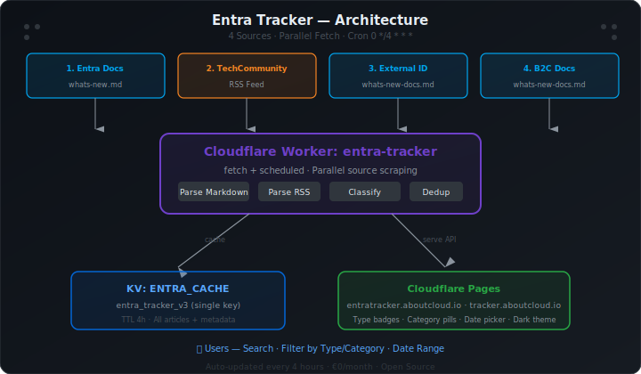

# Entra Tracker — Microsoft Entra ID Change Tracker

> Live tracker for Microsoft Entra ID retirements, breaking changes, preview features, and what's-new updates. Auto-updated every 4 hours from official Microsoft sources.

**Author:** [Antonio Russo](mailto:arusso@aboutcloud.io) · [aboutcloud.io](https://aboutcloud.io)

<p align="center">
  <a href="https://github.com/arusso-aboutcloud/Entra-Tracker/actions/workflows/trivy-scan.yml"></a>
  <a href="./LICENSE"></a>
  
  
  
</p>

**Live:** [entratracker.aboutcloud.io](https://entratracker.aboutcloud.io) | [tracker.aboutcloud.io](https://tracker.aboutcloud.io)  
**API:** `https://api.aboutcloud.io/entra-tracker`

---

## Architecture

<p align="center">
  
</p>

---

## What It Does

A fully automated, €0/month change tracker that monitors four official Microsoft source repositories and RSS feeds for Entra ID updates — what's new, previews, retirements, and breaking changes. Every update is classified by type, service category, and impact, then served through a searchable, filterable web UI.

---

## Security Scan

<p align="center">
  <a href="https://github.com/arusso-aboutcloud/Entra-Tracker/actions/workflows/trivy-scan.yml"></a>
</p>

This repository is continuously scanned by [Trivy](https://trivy.dev/) on every push and daily at midnight UTC. The badge above is **live** — it updates automatically via GitHub Actions after each scan.

<details>
<summary>📊 Latest Trivy Report (click to expand)</summary>

> Full results available in the [Actions tab](https://github.com/arusso-aboutcloud/Entra-Tracker/actions/workflows/trivy-scan.yml).

| Scanner | Status |
|---|---|
| Secrets | Scanned on every push |
| Misconfigurations | Scanned on every push |
| Vulnerabilities | Scanned on every push |

</details>

---

## Cloudflare Infrastructure

### Worker

| Property | Value |
|---|---|
| Handlers | `fetch`, `scheduled` |
| Compatibility date | 2026-03-31 |

**Bindings:**

| Name | Type | Details |
|---|---|---|
| `ENTRA_CACHE` | KV Namespace | Single-key cache of parsed articles + metadata |

**Cron Trigger:** Every 4 hours — scrapes all 4 sources in parallel and refreshes KV.

### Pages

| Property | Value |
|---|---|
| Deployment type | Git-based (branch: main) |
| Tech | Static HTML + inline CSS/JS |

### KV: `ENTRA_CACHE`

**Key:** `entra_tracker_v3` — single-key storage containing all parsed articles and metadata.

---

## API

**Base URL:** `https://api.aboutcloud.io/entra-tracker`

### `GET /`
Returns full article catalog with metadata.

**Query parameters:**

| Parameter | Values | Description |
|---|---|---|
| `format` | `csv` | Return dataset as CSV instead of JSON. Reuses cached data — does not trigger a re-fetch. Columns: `title,category,impact,status,announcedDate,deadline,daysRemaining,namespace,link`. Response includes `Content-Disposition: attachment; filename="entra-tracker.csv"`. |
| `refresh` | `1` | Bypass KV cache and force a fresh fetch from all sources. |

**`announcedDate` field:** Each item now includes `announcedDate` (ISO `yyyy-mm-dd` or `null`). Populated from the `## Month YYYY` section header in whats-new.md / docs changelogs, the commit date in the commits source, or the RSS pubDate. This is the publication/announcement date only — it never becomes a deadline.

---

## Data Sources

| # | Source | Type | Description |
|---|---|---|---|
| 1 | `entra-docs: fundamentals/whats-new.md` | Markdown | Core Entra ID + B2C/External ID what's-new |
| 2 | TechCommunity RSS | RSS | Entra blog announcements |
| 3 | `entra-docs: external-id/whats-new-docs.md` | Markdown | External ID docs changelog |
| 4 | `azure-docs: active-directory-b2c/whats-new-docs.md` | Markdown | B2C docs changelog |
| 5 | `entra-docs: commits — external-id/customers` | GitHub Commits API | External ID customer how-tos (direct repo watch, pre-changelog) — catches passkey/FIDO2 guides before MS adds them to the curated index |

---

## Classification

### Update Types
- **Preview** — public preview features
- **GA** — generally available
- **Retirement** — features being deprecated/retired
- **Breaking Change** — changes requiring action
- **Plan for Change** — upcoming changes
- **Updated** — documentation updates

### Service Categories
Tracked per item based on Microsoft's own categorization (Entra ID Protection, Conditional Access, External ID, B2C, etc.).

---

## Frontend Features

- 🔍 Full-text search — across title, description, category, type
- 🏷️ Type filters — Preview, GA, Retirement, Breaking Change, Plan for Change
- 📂 Service category pills — filter by Entra service area
- 📅 Date range picker — scope by time period
- 📊 Stats bar — total items, breakdown by type
- 🔗 Crosslinks to aboutcloud.io and entraerrors.aboutcloud.io
- 🌙 Dark theme (Entra-inspired)
- 📣 Announced date display — cards without a deadline show "Announced Mon YYYY" instead of an empty right panel
- 🔃 Newest-announced sort — sort the entire feed by `announcedDate` descending to see what's freshest
- ⭐ On Radar (client-side watchlist) — star any item to add it to your personal watchlist; persisted in `localStorage` under key `entratracker_radar`; filter to starred items with the "On Radar" toggle; cross-device sync is out of scope (see ROADMAP.md)

---

## Repo Structure

```
├── api/                  # Worker script
│   ├── worker.js         # Full worker source
│   └── wrangler.toml     # Worker configuration
├── web/                  # Pages frontend
│   ├── index.html        # Full frontend
│   └── wrangler.toml     # Pages configuration
├── .github/workflows/    # CI/CD
│   └── trivy-scan.yml    # Automated security scanning
├── architecture.svg      # Architecture diagram
├── trivy-badge.svg       # Auto-updated security badge
├── LICENSE
└── README.md
```

---

## Quick Start

1. **Clone:** `git clone https://github.com/arusso-aboutcloud/Entra-Tracker.git`
2. **Install Wrangler:** `npm install -g wrangler`
3. **Create KV namespace:** `wrangler kv:namespace create ENTRA_CACHE`
4. **Update `wrangler.toml`** with your KV namespace ID
5. **Deploy:** `wrangler deploy`

---

## License

MIT — see [LICENSE](./LICENSE) for full text.

> 💼 **Using this commercially?** MIT licensed and free for personal, educational, and open-source projects.  
> Building something commercial (SaaS, managed services, reselling)? I'd love to chat —  
> [contact me](https://aboutcloud.io/author/)

---

*Last reconciled: 2026-04-29*
