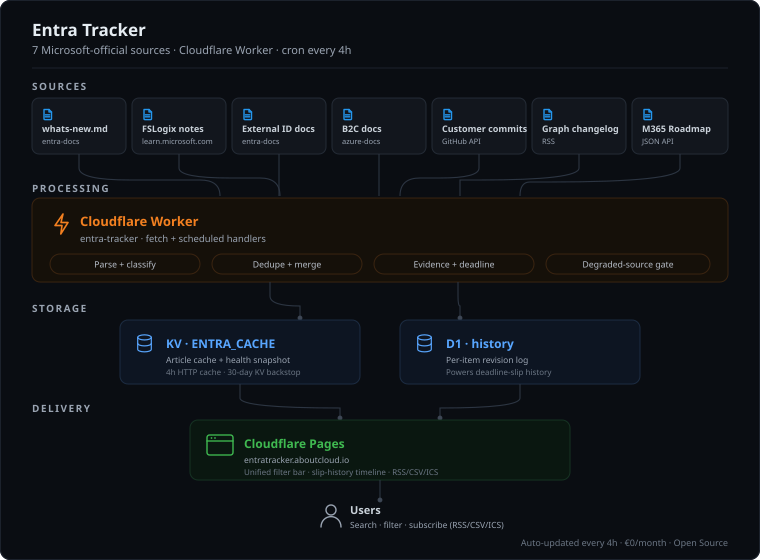

# Entra Tracker — Microsoft Entra ID Change Tracker

> Live tracker for Microsoft Entra ID retirements, breaking changes, preview features, and what's-new updates. Auto-updated every 4 hours from official Microsoft sources.

**Author:** [Antonio Russo](mailto:arusso@aboutcloud.io) · [aboutcloud.io](https://aboutcloud.io)

<p align="center">
  <a href="https://github.com/arusso-aboutcloud/Entra-Tracker/actions/workflows/trivy-scan.yml"></a>
  <a href="./LICENSE"></a>
  
  
  
</p>

**Live:** [entratracker.aboutcloud.io](https://entratracker.aboutcloud.io) | [tracker.aboutcloud.io](https://tracker.aboutcloud.io)  
**API:** `https://api.aboutcloud.io/entra-tracker`

---

## Architecture

<p align="center">
  
</p>

---

## What It Does

A fully automated, €0/month change tracker that monitors seven official Microsoft sources for Entra ID updates -- what's new, previews, retirements, breaking changes, and the Microsoft 365 Roadmap. Every update is classified by type, service category, and impact, then served through a searchable, filterable web UI.

---

## Security Scan

<p align="center">
  <a href="https://github.com/arusso-aboutcloud/Entra-Tracker/actions/workflows/trivy-scan.yml"></a>
</p>

This repository is continuously scanned by [Trivy](https://trivy.dev/) on every push and daily at midnight UTC. The badge above is **live** — it updates automatically via GitHub Actions after each scan.

<details>
<summary>📊 Latest Trivy Report (click to expand)</summary>

> Full results available in the [Actions tab](https://github.com/arusso-aboutcloud/Entra-Tracker/actions/workflows/trivy-scan.yml).

| Scanner | Status |
|---|---|
| Secrets | Scanned on every push |
| Misconfigurations | Scanned on every push |
| Vulnerabilities | Scanned on every push |

</details>

---

## Cloudflare Infrastructure

### Worker

| Property | Value |
|---|---|
| Handlers | `fetch`, `scheduled` |
| Compatibility date | 2026-03-31 |

**Bindings:**

| Name | Type | Details |
|---|---|---|
| `ENTRA_CACHE` | KV Namespace | Single-key cache of parsed articles + metadata |
| `TRACKER_DB` | D1 Database | `entra-tracker-history`, write-only revision history (Phase 3) — see below |

**Cron Trigger:** Every 4 hours -- fetches all 7 sources in parallel and refreshes KV.

**CI Deploy:** `.github/workflows/deploy-worker.yml` runs `wrangler deploy` automatically
on every push to `main` that touches `api/**`. Runs on Node.js 24 (`FORCE_JAVASCRIPT_ACTIONS_TO_NODE24`
+ `wrangler-action@v4`). Requires two repo secrets set in
GitHub Settings > Secrets and variables > Actions:
`CLOUDFLARE_API_TOKEN` (Workers Scripts:Edit permission) and `CLOUDFLARE_ACCOUNT_ID`.

**Worker secret:** `REFRESH_TOKEN` (optional but recommended) — set via
`wrangler secret put REFRESH_TOKEN --config api/wrangler.toml` or the Cloudflare
dashboard. Gates the `?refresh=1` bypass; without it, `refresh=1` is ignored.

**Env var:** `DEGRADED_WEBHOOK_URL` (optional, Phase 4) — if set, a small JSON payload (`{source, transitionedAt, currentCount, trailingMedian}`) is POSTed once per source on the **transition into** degraded state (not on every build while still degraded). Absent → the feature is silently off, same pattern as `REFRESH_TOKEN`. Non-fatal: a failed POST is logged and otherwise ignored.

**Deploy runbook — do this after any deploy that touches cache-write timing
or identity/dedup logic (worth doing after any deploy, cheap either way):**
once `REFRESH_TOKEN` is set, call `?refresh=1` with the correct
`X-Refresh-Token` header immediately after the deploy finishes. This forces
the KV entry to rewrite under the new code *before* the next natural 4h
cron cycle, carrying `firstSeen` forward under the new logic instead of
leaving the old entry's TTL/format to run out on its own. This would have
prevented the 2026-08-14 cold start documented in PR #22 — the fix that
shipped in that PR only governs writes made after it deployed, so the
already-in-flight entry (written by the pre-fix code, with the old 4h TTL
already counting down) expired on schedule regardless, one cron cycle
after the fix landed, and forced exactly one more cold start before the
new logic took over.

### Pages

| Property | Value |
|---|---|
| Deployment type | Git-based (branch: main) |
| Tech | Static HTML + inline CSS/JS |

### KV: `ENTRA_CACHE`

**Key:** `entra_tracker_v3` — single-key storage containing all parsed articles and metadata.

**Key:** `entra_tracker_health_v1` (Phase 4) — separate key, same namespace. Per-source item-count history (trailing window, up to 7 successful builds) and current degraded state. Deliberately **not** stored in D1: D1 (Phase 3) is explicitly allowed to fail non-fatally, and tying health *monitoring* to the one store that's designed to be ignorable would mean health could go dark exactly when something is already under stress. KV is the same store the primary feed already depends on, so this adds no new entanglement. Read by `GET /health` (a single cheap read, never a live rebuild) and written once per build by `applyDegradedGate()`.

### D1: `entra-tracker-history` (binding `TRACKER_DB`)

Write path from Phase 3 (still exactly as it was — see below); a **read** path was added in a later, separate work order and is documented under "Slip-history read path" further down. The write path exists so deadline-slip history *starts accumulating*, because it can't be reconstructed retroactively.

| Property | Value |
|---|---|
| Database name | `entra-tracker-history` |
| Database ID | `2fa8bcf3-1180-45dc-b866-93abfbd00c54` |
| Created | 2026-08-16, via the Cloudflare API (D1 database creation), Phase 3 |
| Schema | `api/migrations/0001_create_item_revisions.sql` — one `item_revisions` table, one index `idx_item_revisions_item_id_id (item_id, id DESC)` |

**What it records:** on each build, after the item set is fully finalised (post-dedupe, post-taxonomy), every item's tracked fields (`title`, `category`, `status`, `deadline`, `deadlineConfidence`, `announcedDate`, `serviceCategory`) are hashed. A row is inserted only when that hash differs from the item's most recently stored revision (or it has none yet) — unchanged items write nothing. Each inserted row also records `changed_fields`: which of the tracked fields actually differ from the prior revision.

**Non-fatal by design:** every D1 access is wrapped so a failure — connection, migration drift, constraint violation, timeout — can never prevent the KV write, alter the API response, or throw out of the build. Diagnostics go to the Worker's console log only, never into the response `warnings[]` array, so the API envelope is byte-for-byte identical whether D1 is healthy, failing, or entirely absent. Verified with a dedicated test (`api/worker.test.js`) that runs the full build with a D1 binding that throws on every call and confirms the response is unchanged.

**Cold-start safe:** the write decision is keyed off D1's own stored history, not the KV cache's `coldStart` flag — a KV cold start doesn't cause a revision-store write storm, because D1 still remembers what it saw last time regardless of what happened to the KV cache. The only scenario that inserts a full-corpus baseline in one build is D1's own first-ever run against an empty table, which is expected and one-time.

**The write path (`writeRevisions()`, the schema, `REVISION_FIELD_COLUMNS`) is untouched by the read work below** — read-only against the existing store, no table changes; the pre-existing index already served every read query needed, so no migration was required for this phase either.

## Slip-history read path (net-new)

Exposes the D1 store above, which had been write-only and silently accumulating since 2026-08-16.

### `GET /entra-tracker/history/:itemId`

No auth, read-only, cheap. `itemId` must match `^[0-9a-f]{8}$` (the real shape of every item id — see "Item identity" above); anything else is rejected before it ever reaches D1, at zero query cost. Returns:

```json
{
  "itemId": "6ec464da",
  "found": true,
  "revisions": [
    { "observedAt": "2026-08-16T15:00:00.000Z", "title": "...", "category": "...", "status": "...", "deadline": null, "deadlineConfidence": null, "announcedDate": "...", "serviceCategory": "...", "changedFields": [] },
    ...
  ],
  "deadlineHistory": [
    { "deadline": "2025-06-01", "observedAt": "2026-06-01T00:00:00.000Z" },
    { "deadline": "2025-10-01", "observedAt": "2026-07-01T00:00:00.000Z" }
  ],
  "deadlineChangeCount": 1
}
```

- `revisions[]` is the full ordered log for that item, oldest first, row-capped at 200. The first revision is always the baseline — its `changedFields` is `[]` (nothing to diff against), never populated as if every field mutated.
- `deadlineHistory[]` is the headline signal: the `deadline` column run-length-encoded to its distinct-value sequence (e.g. "Jun → Oct → Mar"). An item rebuilt 40 times with an unchanged deadline still has a single-entry `deadlineHistory` — status/title changes that leave `deadline` untouched don't count as a "slip." `null` is tracked as a real value too (an item can gain or lose a deadline entirely).
- `deadlineChangeCount` is `deadlineHistory.length - 1`.
- Unknown item id, or D1 unavailable, both return a clean, well-formed empty shape (`found: false`, empty arrays) — 404 for unknown, 503 if D1 itself is unreachable — never a 500 that reads as "the tracker is broken."
- **Query plan:** a single indexed lookup, `WHERE item_id = ? ORDER BY observed_at ASC, id ASC LIMIT 200`, served by the existing Phase 3 index `(item_id, id DESC)` (SQLite can walk an index in either direction). Tiebreaks on the autoincrement `id`, same reasoning as the write path: `observed_at` can collide across a retried write, `id` can't. Never fetches upstream, never triggers a rebuild.

### `deadlineChangeCount` on every item (additive)

Every item in the main envelope's `items[]` now also carries `deadlineChangeCount` (0 = never moved, as far as the tracker has observed). Computed **once per build**, not per item/per request: a single batch aggregate query against D1, scoped to only the current build's item ids (`WHERE item_id IN (...)`) so cost stays proportional to today's feed size, not to years of accumulated history for items that have long since aged out. Uses SQLite window functions (`LAG`/`ROW_NUMBER`, confirmed supported against the live database before writing this) to detect, per item, how many of its revisions actually changed `deadline` versus the immediately preceding one. Non-fatal — a query failure yields every item defaulting to `deadlineChangeCount: 0`, proven with a dedicated test that runs a full build against a throwing D1 and diffs the result against a no-D1 build.

The PR #28 "Revised" badge (`↻`), previously a placeholder bound to `titleHistory[]` (any reworded title), now binds to this real signal exclusively — it only fires on a genuine deadline change, which is what actually makes a card worth expanding for the timeline. Same badge, real data, not a second badge.

**Honesty about coverage:** "moved N times" only counts changes the tracker has personally observed since it started recording (2026-08-16) — an item that slipped before that date, with no further change since, currently shows as "never moved." This is stated plainly in `/methodology`, not smoothed over.

**Observed revision-count distribution at merge time** (live D1, queried directly before writing this PR): 103 total rows, 103 distinct items — **every current item has exactly one revision (its baseline)**. Zero items have more than one revision yet, so `deadlineChangeCount` is currently `0` for the entire live feed and no card shows the "Revised" badge in production today. This is expected, not a bug: the store is young (its first real production write was the same day it was created) and this feature was explicitly designed to render gracefully at zero — badge absent, no timeline, no fetch — and get richer as more builds run and real changes accumulate. Verification of the rich (multi-slip) UI states used mocked data for this reason; see the PR for screenshots of both the sparse (real, current) and rich (mocked, future) states.

---

## API

**Base URL:** `https://api.aboutcloud.io/entra-tracker`

### `GET /`
Returns full article catalog with metadata.

### `GET /taxonomy`
Returns the single service taxonomy definition (`{ taxonomy: [{ id, name }, ...] }`) that every item's `serviceCategory` is classified against, and that the frontend's service-area dropdown and `/methodology` coverage statement both read from. No auth, cache-only (static in-memory structure — never touches KV or triggers an upstream fetch), always available regardless of cache state.

### `GET /health` (Phase 4)
Machine-readable per-source health, meant to be polled by an external monitor. No auth, strictly read-only and cheap: a single KV read of a stored snapshot. **Never** triggers a source fetch, a rebuild, or a D1 query — hitting it in a loop costs nothing upstream and never touches the main endpoint's cost path.

```json
{
  "status": "ok" | "degraded",
  "degraded": ["<source>", ...],
  "lastUpdated": "<ISO, when the underlying snapshot was last written>",
  "sources": {
    "<source>": {
      "lastSuccessAt": "<ISO or null>",
      "lastCount": 91,
      "trailingMedian": 90,
      "ratio": 1.01,
      "degraded": false
    },
    ...
  }
}
```

`ratio` and `trailingMedian` are `null` until a source has at least one successful build recorded (see "Degraded mode" below for how the trailing window fills). Source ids match `item.source` (`entra-whatsnew-md`, `fslogix-docs`, `external-id-docs`, `b2c-docs`, `external-id-commits`, `graph-changelog`, `m365-roadmap`) — note the main envelope's `sources` object uses slightly different key spellings (a pre-existing inconsistency, not touched here); `/health`'s keys are the canonical `item.source` values.

**Query parameters:**

| Parameter | Values | Description |
|---|---|---|
| `format` | `csv` | Return dataset as CSV instead of JSON. Reuses cached data — does not trigger a re-fetch. Columns: `title,category,impact,status,announcedDate,firstSeen,deadline,daysRemaining,namespace,link`. Response includes `Content-Disposition: attachment; filename="entra-tracker.csv"`. |
| `format` | `rss` | Return top 50 items as RSS 2.0 feed, newest-first by `firstSeen`. Reuses cached data. `Content-Type: application/rss+xml`. Respects `namespace` filter. |
| `format` | `ics` | Return every item with a real `deadline` as an iCalendar (RFC 5545) subscription feed — one all-day `VEVENT` per dated item, unfiltered by status (a past deadline still gets an event, same as CSV). Reuses cached data. `Content-Type: text/calendar`. Respects `namespace` filter. See "Calendar (.ics) feed" below. |
| `namespace` | `external-id` | Filter items to External ID namespace only. Works with JSON, CSV, RSS, and ICS formats. |
| `refresh` | `1` | Bypass KV cache and force a fresh fetch from all sources. **Requires** an `X-Refresh-Token` request header matching the `REFRESH_TOKEN` secret; if that secret isn't configured, `refresh=1` is silently ignored and the cached response is served instead. |

**`announcedDate` field:** Each item now includes `announcedDate` (ISO `yyyy-mm-dd` or `null`). Populated from the `## Month YYYY` section header in whats-new.md / docs changelogs, the commit date in the commits source, or the RSS pubDate. This is the publication/announcement date only — it never becomes a deadline.

**`dedupeDropped` field:** The envelope includes a `dedupeDropped` count from dedupe **stage 1** — items collapsed because the *same source* reported the exact same normalised title more than once in one build. This should be near-zero in normal operation (it indicates a parser emitting a genuine repeat, e.g. a stray re-scan of a block); a persistently nonzero value is worth investigating, not expected.

**`crossSourceMerged` field:** The envelope includes a `crossSourceMerged` count from dedupe **stage 2** — items that were the *same underlying change reported by more than one Microsoft source* (e.g. both `whats-new.md` and a docs changelog cover the same retirement) and were merged into a single item. Unlike `dedupeDropped`, a nonzero `crossSourceMerged` is expected and routine — it's the normal case for changes that get dual coverage. Merged items keep the existing scalar `source`/`link` fields pointing at the highest-provenance contributor, and add `sources: []` / `links: []` arrays listing every source that reported the change. `external-id-commits` items are exempt from stage 2 in both directions (never merged into another source's item, never absorb one) since they're a pre-changelog how-to watch, not independent coverage of the same announcement.

**Cache behavior:** The HTTP `Cache-Control: max-age` and the underlying KV entry's TTL are decoupled. Responses are cached for 4 hours (matching the cron refresh interval), but the KV entry itself persists for 30 days as a backstop — so a single missed or failed cron run no longer expires the cache and forces a cold start (which would reset every item's `firstSeen` and republish the whole feed as "new").

**CORS:** every response (including 404s and errors) carries `Access-Control-Allow-Origin` for the caller's origin plus `Vary: Origin`, so shared/edge caches key on the request origin instead of serving one origin's CORS headers to another.

**Deadline fields (`deadlineConfidence`, `deadlineEvidence`, `deadlinePrecision`):** every item's deadline now comes with how sure the tracker is about it. `deadlineConfidence` is `'stated'` (an explicit cessation phrase — "retired", "deprecated", "must migrate" — in the same sentence as the date), `'derived'` (cutoff language nearby but not same-sentence), `'inferred'` (the best candidate found, but without clear supporting language), or `null` (no date found at all). `deadlineEvidence` is the literal sentence the date was taken from. `deadlinePrecision` is `'day'` or `'month'` depending on how precisely Microsoft stated it. The frontend does not render a countdown for `'inferred'` — it shows the date with an explicit "unconfirmed" hedge instead. See `/methodology` in the web UI for the plain-language version.

**`evidence` field:** every item carries `evidence: { tier, basis, quote, sourceUrl }` recording how strong Microsoft's own signal was. `tier` is `'A'` (structured metadata — a `**Type:**` block or a Graph changelog deprecation), `'B'` (official documentation content without structured metadata), or `'C'` (a repo signal that a document moved — an indicator, not an announcement; currently only the `external-id-commits` source). `basis` is the specific mechanism: `'ms-type-field' | 'graph-changelog' | 'doc-callout' | 'repo-signal' | 'keyword-heuristic'`. Cross-source merges now rank by tier first (A beats B beats C), falling back to the fixed source-priority table only to break ties within the same tier.

**`sources`/`links` arrays and `titleHistory`:** unchanged from Phase 0.1's cross-source merge — see that section below. `titleHistory: []` is new: when an item's title is reworded between two builds (Microsoft edits a whats-new.md heading) and the tracker's similarity matching recognises it as the same item, the prior title is appended here and `firstSeen` carries forward instead of resetting.

**`firstSeenEstimated` field:** `true` when `firstSeen` was estimated from `announcedDate` during a cold start (no usable prior snapshot) rather than observed directly; `false` otherwise, including for every item in normal operation. See "Cold-start firstSeen repair" below.

**Item identity (`id`):** composed from `source` + `link` + normalised title (previously a bare hash of the title, with ad hoc per-parser prefixes). The format is unchanged (8 hex characters). A rewording of an item's title is now tolerated via similarity matching (same source, same `announcedDate` month, title similarity ≥0.70 — validated against a real MicrosoftDocs heading-rename commit, see `api/worker.js`'s `TITLE_REWORD_SIMILARITY_THRESHOLD` comment) rather than minting a new id and resetting `firstSeen`.

**Cold-start `firstSeen` repair:** on a cold start (no usable prior snapshot — see Cache behavior above), each item's `firstSeen` is seeded from its `announcedDate` when that's in the past, rather than flattened to the day of the cold start for every item at once (the failure mode documented in PR #22, 2026-08-14). Items without a usable `announcedDate` still fall back to the cold-start date. The RSS feed also now falls back to `announcedDate` as a secondary sort key when `firstSeen` values tie, so a future cold start degrades to an estimated-but-ordered feed instead of collapsing to arrival order.

## Calendar (.ics) feed

`GET /entra-tracker?format=ics` — every tracked item with a real `deadline`, one per year at most as an admin subscribes once and it stays current, rather than a one-off CSV download. Hand-built strings, no library (kept the Worker bundle dependency-free, same as CSV/RSS).

- **One `VEVENT` per dated item**, all-day (`DTSTART`/`DTEND;VALUE=DATE`, `DTEND` the day after `DTSTART` per the all-day-event convention). Dateless items are skipped — nothing to put on a calendar.
- **Not filtered by status** — a past (expired) deadline still gets an event, exactly like the CSV export's behaviour; a calendar client naturally shows a past event as past.
- **`deadlineConfidence: 'inferred'` items are included, not excluded**, with a leading `~` in `SUMMARY` and an "(unconfirmed — verify against the source)" note in `DESCRIPTION` — the same hedge the frontend already shows as "possible date… unconfirmed" rather than a countdown. Throwing the information away outright would lose real signal a subscriber might still want.
- `SUMMARY` = an urgency emoji marker (🔴/🟡/🟢/⚫, matching the frontend's own colour system) + the item title. `DESCRIPTION` = category, service area, evidence tier, deadline confidence, and the source link. `URL` = the item link.
- One `VALARM` per event: `TRIGGER:-P3D` (a 3-day-before reminder, `ACTION:DISPLAY`).
- RFC 5545 compliance: CRLF line endings throughout; `,` `;` `\` and newlines escaped in `SUMMARY`/`DESCRIPTION`; lines folded at 75 UTF-8 octets (not characters — a SUMMARY with an emoji marker is byte-aware, code-point-safe so a fold never splits an emoji) with a single-space continuation prefix, per the spec. `UID` is `<item.id>@entratracker.aboutcloud.io` — stable across builds as long as the item's own identity doesn't change (see "Item identity" above).
- **Non-fatal per event:** a single malformed item (an unparseable deadline) is skipped, logged, and does not corrupt the rest of the calendar — verified with a dedicated test that mixes one broken item between two valid ones.
- Verified two ways before shipping: unit tests covering escaping/folding/tentative-marker/non-fatal-skip, and an independent RFC 5545 parser (`node-ical`) round-tripping the real output of a live production fetch — 5 real dated items parsed back out correctly (all-day dates, alarms, UIDs, the tentative marker on the one `inferred`-confidence item).
- Appears as its own row in the frontend's Subscribe/Export popover, alongside RSS/CSV/JSON.

**Threshold note:** the cross-source merge similarity threshold (0.82, Phase 0.1) has only ever fired on hand-built fixtures — `crossSourceMerged` has been 0 against live data every time it's been checked so far. The first time it fires for real, the merge should be spot-checked before being trusted; don't tune the threshold without that evidence.

**`announcements[]` field (Phase 5, additive):** every item now carries `announcements: []`. Empty for almost everything; populated when a Microsoft 365 Roadmap entry has been correlated to this item (see "Microsoft 365 Roadmap correlation" below). Each entry:

```json
{
  "type": "roadmap",
  "id": "518221",
  "url": "https://www.microsoft.com/en-us/microsoft-365/roadmap?searchterms=518221",
  "statedStatus": "Launched",
  "statedDate": "2026-04",
  "matchBasis": "exact-id" | "strong-title-date",
  "matchConfidence": 1
}
```

`statedDate` is month-precision (`yyyy-mm`), exactly as the roadmap gives it — never padded to a fabricated day. `matchBasis` is `'exact-id'` (the item's own text explicitly references the roadmap feature id — treat as a fact) or `'strong-title-date'` (title + date similarity cleared a conservative bar — treat as a hint, not a fact; the frontend labels this "likely related").

**`dateConflict` field (Phase 5, additive):** `true` when a correlated roadmap entry's stated date disagrees (different month) with an existing `deadline` already derived for that item from another Microsoft source. Both dates are kept — the roadmap date never overwrites `deadline` — this is meant to surface a genuine disagreement between two official Microsoft channels, not to be resolved automatically. `false` on every other item, including every item with no roadmap correlation at all.

## Microsoft 365 Roadmap correlation (Phase 5)

Roadmap items carry structured Microsoft metadata (a feature id, a lifecycle status, a stated date) and are treated as evidence tier A, same as a `**Type:**` block or a Graph changelog deprecation sentence.

**Deliberately conservative, on purpose:** the Phase 0.1 cross-source merge threshold (0.82) has never once fired against real data in this codebase's history — an unvalidated threshold that just silently never engages is a real failure mode, not a hypothetical one. Phase 5 does not repeat it: correlation only auto-attaches on two conservative bases, and everything else is captured for evidence rather than guessed at.

- **`exact-id`** — the tracked item's own text explicitly references the roadmap feature's numeric id. Strongest possible basis; attaches unconditionally, no date-window requirement.
- **`strong-title-date`** — title similarity (via a roadmap-specific `roadmapTitleSimilarity()`, deliberately separate from the existing `titleSimilarity()` that backs the already-shipped 0.82/0.70 thresholds — see `api/__fixtures__/roadmap/README.md` for why reusing the shared function would have understated a real, genuine match) clears `STRONG_TITLE_DATE_SIMILARITY_THRESHOLD = 0.75`, **and** the roadmap's stated date falls within `ROADMAP_DATE_WINDOW_MONTHS = 1` of the tracked item's own deadline/announced date. Both conditions validated against one real pair (roadmap id `518221` vs. its real `whats-new.md` counterpart, both describing "Cross-tenant security group synchronization") — same "validate against a real pair, set the bar with margin below it" methodology Phase 1 used for its own 0.70 threshold.

A correlated roadmap item does **not** become its own card — it attaches to the matched item's `announcements[]` instead. An uncorrelated roadmap item (surviving the product-tag pre-filter and the taxonomy, matching nothing) becomes its own standalone tier-A item.

**Sub-threshold capture, not assertion:** every near-miss (some title similarity found, but not enough to clear the bar) is recorded — roadmap id, tracked item id, score, date gap — in KV under `entra_tracker_roadmap_candidates_v1` (capped at 200, most-recent-first). This is diagnostic-only: it is never exposed via the public API or the frontend. It exists so the threshold can eventually be recalibrated from real accumulated evidence instead of being guessed at twice.

**Non-fatal, side-band:** correlation runs per roadmap item with its own try/catch — one malformed item can't cost every *other* roadmap item in the same build its chance to correlate or publish, and a total correlation failure still leaves roadmap items publishing as standalone (uncorrelated) rather than being lost. `m365-roadmap` also gets its own trailing health baseline in the Phase 4 degraded gate (below) — a roadmap outage degrades exactly like any other source's outage, and a zero-count build doesn't poison its own baseline.

## Degraded mode (Phase 4)

The failure mode this closes: a source's HTML restructures, the parser returns 200 with 3 items instead of 90, and every missing item silently vanishes from the feed with no signal. "Never lie quietly" is the whole point.

**How it's detected:** each source's raw parse count (before taxonomy/dedupe touch anything) is compared against a trailing median of its last 7 successful builds. A source returning **fewer than 50% of its trailing median** — including a drop to zero — is treated as degraded for that build. Sources whose trailing median is small (≤5 items — `fslogix-docs`, `external-id-docs`, `graph-changelog` normally run this low, and `b2c-docs` legitimately sits at or near zero for long stretches since B2C is end-of-sale) are **exempt from the ratio test entirely**, so ordinary small-number noise never trips it.

**What happens when a source is degraded:** that source's items for this build are **replaced with the previous good snapshot's items for that source**, each flagged additive `stale: true`, and the source name is added to the additive envelope array `degraded: []`. The source's trailing baseline is **not** updated on a degraded build — otherwise a shrunken count would poison the median and the source could never recover its own threshold.

**Rollout / first population:** on a source's first-ever build (or right after this phase first deploys), there's no trailing history to compare against — the gate **never** flags a source degraded when its history is empty, it just starts recording. The window fills over the following ~7 successful builds (roughly 28 hours at the 4-hour cron cadence) before the gate has real teeth.

**Non-fatal:** if the stored count-history KV key is unreadable, degraded detection simply turns off for that build (every source treated as healthy) — the feed still builds and publishes normally. Proved with a dedicated test.

**API additions (additive only):** `degraded: []` on the envelope, `stale: true|false` on every item. Existing fields are unaffected — confirmed with a test that diffs the full envelope with and without a working health-state store.

**Confirmed working in production, first real occurrence (2026-08-17):** the gate flagged `entra-whatsnew-md` degraded for the first time. Root cause, from the envelope's own `errors[]`: `raw.githubusercontent.com` returned `HTTP 429` (rate-limited) simultaneously for three sources on that build (`entra-whatsnew-md`, `external-id-docs`, `b2c-docs` — all hosted on the same domain). Only `entra-whatsnew-md` tripped the degraded flag; the other two sit at trailing medians ≤5 and are correctly exempt from the ratio test by design. Confirmed transient, not a parser break: re-fetching the live source and running the current parser against it immediately afterward returned 91 items, matching the pre-incident trailing median exactly — the page structure never changed. This also prompted a rewrite of the banner copy itself (see "Frontend Features" above) — the original wording read like a product fault when the gate had in fact caught the problem and protected the feed correctly.

**Service taxonomy (`serviceCategory`, `serviceCategories[]`, `unmatched`, `unmatchedSamples`):** every item is now classified against a single, fixed taxonomy (`GET /taxonomy`) instead of each mechanism (External ID detection, the Graph changelog relevance filter, per-parser assumptions) carrying its own scoping logic. `serviceCategory` is **overwritten** with the taxonomy's canonical name for the item's primary match — this normalises Microsoft's raw, inconsistent category strings (`whats-new.md` alone used 30+ of them) into one fixed vocabulary; the field's type/format is unchanged (still a string), only its value changed for most items. The additive `serviceCategories: []` records every taxonomy entry the item matches, not just the primary. An item matching **no** taxonomy entry is dropped, never silently: the envelope's `unmatched: { <source>: N }` counts drops per source, and `unmatchedSamples: []` (capped at 10 total) keeps `{title, source}` so the taxonomy can be extended from evidence. Classification is two-tier: Microsoft's own raw `**Service category:**` field (whats-new.md only) decides the primary when present (authoritative); title/description text only decides it when there's no raw category to go on. See `api/__fixtures__/taxonomy/README.md` for the full raw→canonical mapping and three real classification bugs found and fixed while building this (short version: plain substring matching is dangerous — `signin` matched inside `assigning`, `provisioning` matched inside `cloudPcProvisioningPolicy`).

**Note on primary vs. secondary categorisation:** because the raw-category match always wins primary when present, an item can have a more *specific* topic than its primary category suggests — e.g. a real live item titled "Workload identity-based authentication for SAP SuccessFactors..." carries Microsoft's own raw category "Provisioning" (→ primary `Entra ID (workforce)`), with `Entra Workload ID` demoted to a secondary entry in `serviceCategories[]` rather than lost. This is a deliberate tradeoff: it's what stops incidental mentions elsewhere in an item's body text from hijacking the primary category, at the cost of sometimes under-representing a more specific real topic in the primary field alone. Check `serviceCategories[]`, not just `serviceCategory`, for the full picture.

---

## Data Sources

All sources are Microsoft-official (MicrosoftDocs GitHub repos + learn.microsoft.com).

| # | Source | Type | Description |
|---|---|---|---|
| 1 | `entra-docs: fundamentals/whats-new.md` | Markdown | Core Entra ID + B2C/External ID what's-new (primary source) |
| 2 | `learn.microsoft.com: FSLogix release notes` | HTML | Azure Files / Entra Kerberos breaking-change callouts (`is-warning`/`is-important` alerts + "action required" notices) |
| 3 | `entra-docs: external-id/whats-new-docs.md` | Markdown | External ID docs changelog (`- [Title](url)` bullets) |
| 4 | `azure-docs: active-directory-b2c/whats-new-docs.md` | Markdown | B2C docs changelog (B2C is end-of-sale; winding down) |
| 5 | `entra-docs: commits — external-id/customers` | GitHub Commits API | External ID customer how-tos (direct repo watch, pre-changelog) — catches passkey/FIDO2 guides before MS adds them to the curated index |
| 6 | `developer.microsoft.com: Graph changelog` | RSS | Microsoft Graph API resource/endpoint **deprecations** (e.g. the PIM iteration 2 API retirement). The feed is a 2500+ item firehose, so it is filtered to items with deprecation language whose content matches the service taxonomy (see below) — typically 1–3 high-signal items. |
| 7 | `microsoft.com: 365 Roadmap API` (Phase 5) | JSON API | `https://www.microsoft.com/releasecommunications/api/v1/m365`, unauthenticated. Pre-filtered server-side to items tagged `tagsContainer.products[].tagName === "Microsoft Entra"` (~12 of ~1800 items live), then routed through the same taxonomy as every other source — the tag is only a cheap pre-filter, not the scoping authority. Excludes `status: "Cancelled"` items. See "Microsoft 365 Roadmap correlation" below. |

Changelog parsers track raw-entry counts; if a source matches zero entries the API response includes a `warnings[]` entry so upstream format drift surfaces instead of failing silently.

The Graph changelog's Entra-relevance filter (previously a bespoke `GRAPH_ENTRA_RE` regex) now consumes the same taxonomy definition as everything else (`matchesAnyTaxonomyEntry` — see the Service Categories section below).

---

## Classification

### Update Types
- **Preview** — public preview features
- **GA** — generally available
- **Retirement** — features being deprecated/retired
- **Breaking Change** — changes requiring action
- **Plan for Change** — upcoming changes
- **Updated** — documentation updates

### Service Categories
Every item is classified against a single service taxonomy (14 entries — Conditional Access, Privileged Identity Management, Identity Protection, Entra ID Governance, Global Secure Access, Entra Workload ID, Entra Verified ID, Entra Domain Services, Entra Connect and Cloud Sync, Authentication methods, Microsoft Graph identity APIs, Microsoft identity platform / MSAL, Entra External ID / Azure AD B2C, and the broad Entra ID (workforce) catch-all), exposed at `GET /taxonomy` and readable in the web UI's `/methodology` coverage statement and service-area filter dropdown. Replaces the old per-mechanism scoping (a bespoke Graph-changelog regex, standalone External ID keyword lists, Microsoft's own 30+ raw `whats-new.md` category strings shown as-is). See the API section above for the full field semantics and `api/__fixtures__/taxonomy/README.md` for the raw→canonical mapping table.

### Evidence Tiers
Every item also carries a Tier A/B/C badge recording how strong Microsoft's own signal was for its classification — see the `evidence` field above, or the `/methodology` section in the web UI for the plain-language version aimed at Entra admins rather than developers.

---

## Frontend Features

- 🔍 Full-text search — a peer control in the unified filter bar, not a separate system
- 🎛️ **Unified filter bar** — one control surface, one visual vocabulary (a shared `.chip` toggle component), for urgency, change type, and service area, all multi-select and freely combinable (e.g. "Urgent" + "Conditional Access" together expresses the whole query in two clicks). Replaces what used to be three disconnected mechanisms (a 12-checkbox environment panel, a status-button-row + two `<select>`s, and search) with one mental model. See "Frontend redesign" below for the full rationale.
- 🏷️ Active-filters pill strip — every applied filter, from every axis, renders as its own removable pill directly under the bar, plus a single "Clear all" — no hidden state; what's applied is always fully enumerated in one place
- 📂 Service area chips — sourced live from `GET /taxonomy`, multi-select (previously a single-select `<select>`)
- 📊 Stats dashboard — informational tiles (urgent/plan-now/on-radar/expired counts, plus an External ID summary and a "matches my environment" count); no longer double as filter buttons, since that was one of the three disconnected filter systems the redesign removes — the chips in the filter bar are now the only filter control
- 🔗 Crosslinks to aboutcloud.io and entraerrors.aboutcloud.io
- 🌙 Dark theme (Entra-inspired), consolidated design tokens (see "Frontend redesign" below)
- 📣 Announced date display — cards without a deadline show "Announced Mon YYYY" instead of an empty right panel
- 🔃 Newest-announced sort — sort the entire feed by `announcedDate` descending to see what's freshest
- ⭐ On Radar (client-side watchlist) — star any item (now a button inside each card's summary row that won't also expand/collapse the card) to add it to your personal watchlist; persisted in `localStorage` under key `entratracker_radar`; filter with the "On Radar" chip; cross-device sync is out of scope (see ROADMAP.md)
- 📡 Subscribe / Export — popover button surfacing RSS feeds (full and External ID), a **Calendar (.ics)** subscription (new), CSV export, and JSON API with one-click copy-to-clipboard for pasting into RSS/calendar readers, Teams, Power Automate, and spreadsheets
- 🅰️ Evidence tier badge (Tier A/B/C) on every card — how strong Microsoft's own signal was; the full evidence quote and source link now live in each card's expandable detail region (see "Card redesign" below), not always-visible, to keep the collapsed list scannable
- ⏳ Deadline confidence hedge — cards with an `'inferred'`-confidence deadline show the date plainly ("possible date … unconfirmed") instead of a countdown, since a countdown implies more certainty than the source text actually supports; the same items get a leading `~` in the `.ics` feed
- ↻ "Revised" badge (now wired to real data) — flags an item whose `deadline` has genuinely changed since the tracker started recording it (`deadlineChangeCount > 0`), not just any field change. Expanding the card lazily fetches `GET /entra-tracker/history/:itemId` (only for cards that actually have history — never on page load, never for the 100+ cards a user hasn't opened) and shows the headline deadline-slip sequence ("moved N times: Jun → Oct → Mar") plus the full revision log on demand. Was originally shipped bound to `titleHistory[]` (any reworded title) as a placeholder for this exact feature; same badge, real data now, not a second badge.
- 📊 Methodology section — collapsible, plain-language explanation of evidence tiers and deadline confidence, written for an Entra admin rather than a developer; includes a coverage statement listing every service area the tracker covers, sourced from the same taxonomy as the filter chips, and a section on the Microsoft 365 Roadmap source
- ⟳ Degraded-source banner (rewritten) — appears only when a source's build fell back to retained last-good data. Reassurance-first copy: leads with "showing last confirmed data for {source}", attributes the cause to Microsoft's feed rather than the tracker, states the concrete last-confirmed timestamp per source (reused from `GET /health`, no extra fetch), and closes with "will refresh automatically" (literally true — every cron cycle re-fetches every source regardless of degraded state). Calm accent-blue styling and a `⟳` glyph, not the red-flavored warning triangle the first version shipped with — that copy read like the product was broken when the opposite was true (the gate caught an upstream 429 and protected the feed). Handles one or several degraded sources in the same sentence. Disappears automatically once the source recovers.
- 🕓 Per-source status footer — last successful update time for every source, sourced from `GET /health`; a degraded source's stale timestamp is visually distinguished from the others
- 🛰️ Roadmap announcements on cards (Phase 5) — a correlated Microsoft 365 Roadmap entry renders as a supplementary row (roadmap status, stated date, link), labelled a definite "Roadmap" tag for an explicit id match or a hedged "likely related" for a title/date similarity match; a `dateConflict` between the roadmap and another Microsoft source is shown as a plain, neutral badge rather than silently resolved

### Frontend redesign

A full visual and interaction redesign, fixing two specific problems rather than restyling for its own sake:

**Motion discipline.** The previous design had 7+ infinitely-looping glow/pulse `@keyframes` — a breathing hero title and subtitle, a pulsing "live" dot, a glowing subscribe button, six looping stat-number glows — animating *at rest*, all the time, with nothing having changed. For a trustworthy-signal tool, that reads as decoration pretending the page is alive, which undercuts the actual point. All of it is deleted outright (not just unbound). What's left: `spin` on the loading state, sub-200ms hover/focus/press transitions, and a single one-shot `card-in` entrance that plays once per card each time the filtered list re-renders — motion that means "something changed," never "this page is alive." Urgency is now carried entirely by colour and weight. Every animation is neutralised under `prefers-reduced-motion: reduce`.

**Card redesign.** Each card is now a native `<details>` element: a compact, scannable summary row (title, urgency strip, key badges, evidence tier, countdown, roadmap announcements) with a keyboard-accessible expandable region underneath holding the full description, the evidence quote and its source, service-area/source metadata, and a link into `/methodology`. Scanning 100 items no longer means 100 full-detail hero cards.

**Design tokens.** Consolidated several near-duplicate CSS custom properties that meant the same thing under different names (`--surf`/`--surface2` → `--surface`/`--surface-2`; `--bdr`/`--border` (the latter previously unused) → `--border`; `--bdr-light` → `--border-soft`; `--text2`/`--muted` → `--text-muted`; `--dim` → `--text-dim`) into one name per role. The red/yellow/green/purple semantic palette was already non-duplicated and is untouched.

**Accessibility.** Every interactive element (chips, buttons, links, inputs, card summaries) gets an explicit `:focus-visible` ring rather than relying on (or, in one case — the search input — actively suppressing) the browser default. Filter chips are real `<button>` elements with `aria-pressed` reflecting their toggle state, so a screen reader announces them correctly as toggles, not decorative labels.

**"My environment" panel.** The old 12-checkbox "Tenant Profile" is reframed, not deleted: relabelled "My environment," its copy now states plainly that it's a rough, self-declared, keyword-based approximation — explicitly staged as the future entry point for a real client-side tenant overlay (delegated Microsoft Graph access), which is out of scope for this work order. Its match result now surfaces as a "Matches my environment" chip in the unified bar and folds into the same active-filters pill strip as every other filter, rather than being a fourth parallel system.

---

## Repo Structure

```
├── api/                  # Worker script
│   ├── worker.js         # Full worker source
│   ├── worker.test.js    # Node test-runner unit tests (node --test)
│   ├── __fixtures__/     # Checked-in fixtures for parser/scoring tests
│   │   ├── dedupe/       # Item-level fixtures (dedupe/merge logic, Phase 0.1)
│   │   ├── deadline/     # Real captured Microsoft text (deadline scoring, Phase 1)
│   │   ├── identity/     # Real title-rewording cases (item identity, Phase 1)
│   │   ├── evidence/     # Cross-source tier-ranking fixture (Phase 1)
│   │   ├── taxonomy/     # Real classification fixtures + raw->canonical mapping (Phase 2)
│   │   └── roadmap/      # Real M365 Roadmap capture + real correlation pair + disclosed constructed fixtures (Phase 5)
│   ├── migrations/       # D1 schema migrations (forward-only)
│   │   └── 0001_create_item_revisions.sql  # Revision store table (Phase 3)
│   ├── package.json      # type:module marker for the test runner (no deps)
│   └── wrangler.toml     # Worker configuration (KV + D1 bindings)
├── web/                  # Pages frontend
│   ├── index.html        # Full frontend
│   └── wrangler.toml     # Pages configuration
├── scripts/               # Repo maintenance scripts
│   └── generate_trivy_badge.py  # Renders trivy-badge.svg from scan results
├── .github/workflows/    # CI/CD
│   ├── deploy-worker.yml # Deploys the Worker to Cloudflare on push to main
│   └── trivy-scan.yml    # Automated security scanning
├── architecture.svg      # Architecture diagram
├── trivy-badge.svg       # Auto-updated security badge
├── LICENSE
├── README.md
└── ROADMAP.md
```

---

## Quick Start

1. **Clone:** `git clone https://github.com/arusso-aboutcloud/Entra-Tracker.git`
2. **Install Wrangler:** `npm install -g wrangler`
3. **Create KV namespace:** `wrangler kv:namespace create ENTRA_CACHE`
4. **Update `wrangler.toml`** with your KV namespace ID
5. **Deploy:** `wrangler deploy`
6. **Run tests:** `cd api && node --test` (no install step — zero runtime dependencies)

---

## License

MIT — see [LICENSE](./LICENSE) for full text.

> 💼 **Using this commercially?** MIT licensed and free for personal, educational, and open-source projects.  
> Building something commercial (SaaS, managed services, reselling)? I'd love to chat —  
> [contact me](https://aboutcloud.io/author/)

---

*Last reconciled: 2026-08-16*
